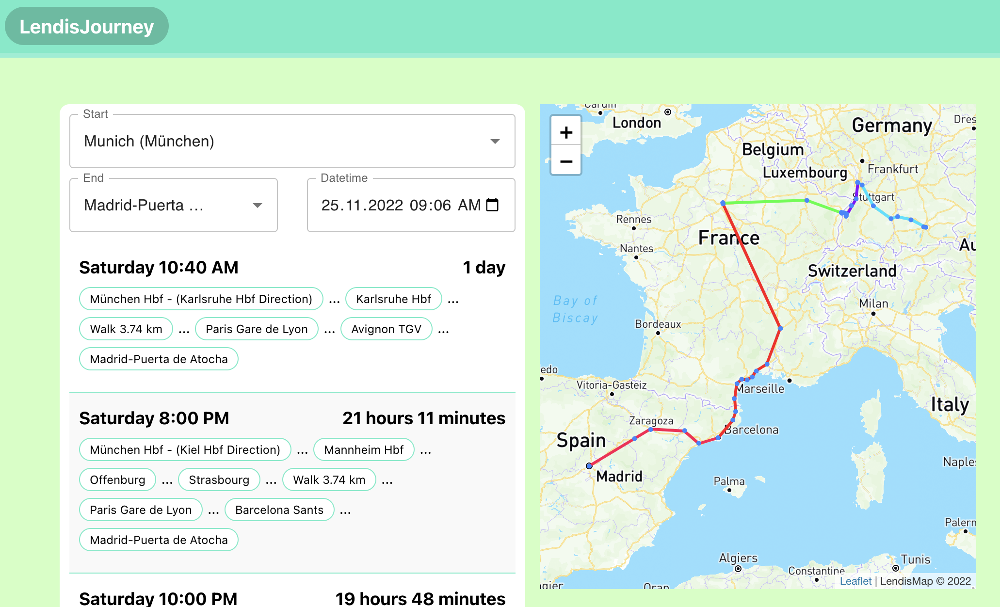

# LendisJourney

An application that suggests many route for you to travel from any place to another.



Demo: [lendisjourney.netlify.app](https://lendisjourney.netlify.app/)

This application uses the "v5.db.transport.rest" api. It shows possible ways. If there is no transfer between the two legs, it shows as walking.

The map uses openstreetmap. Since there is a problem in the Leaflet tests, no test has been written to the lendismap component.

## Install & Test
```
yarn
```

```
yarn test
```

## Start
```
yarn start
```